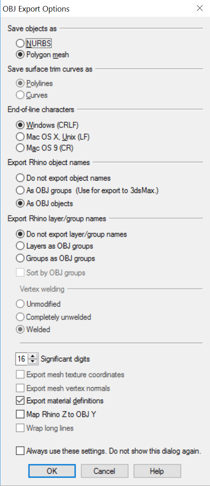

AHWR 
===

Notes
---

Use [Cadmapper](https://cadmapper.com/) to extract 3D terrain DXF

Manual 3D operations:

1. Extrude terrain manually, add materials
2. Use DivideCurveDashed.rvb script in Rhino to generate dashed curves, pipe all curves.
3. Project hatched winery onto topography surface, pipe, etc.
3. Flip normals, or find way to make 2-sided in JSON
4. Move model in center of origin in Rhino just before exporting OBJ with origin (Press enter to use world origin)
5. Use settings: 

6. Use `convert_obj_three.py` python script to convert OBJ to JSON: `python convert_obj_three.py -i deviation_all.obj -o deviation_all.js`

